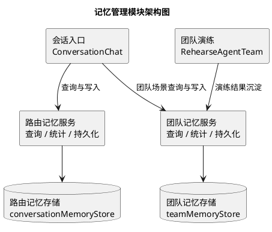
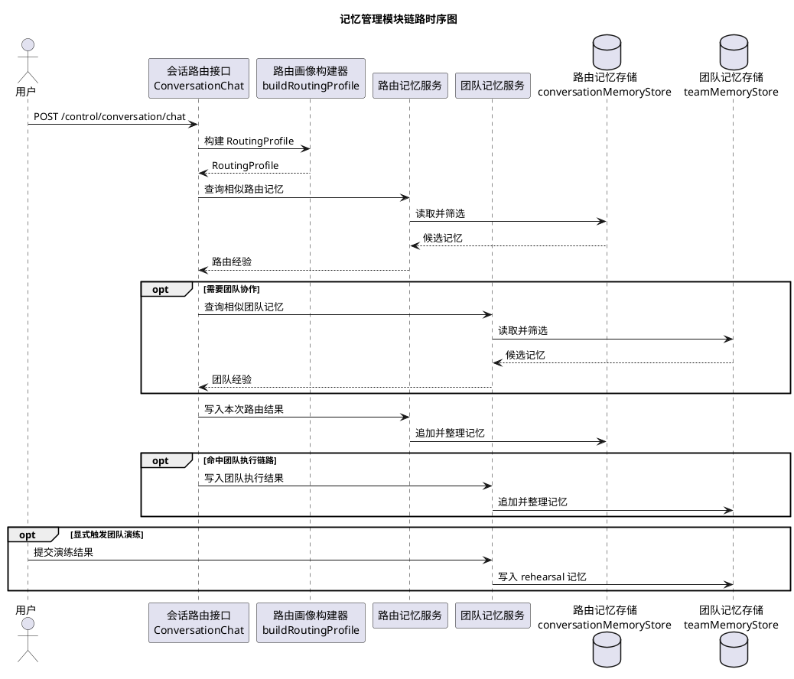
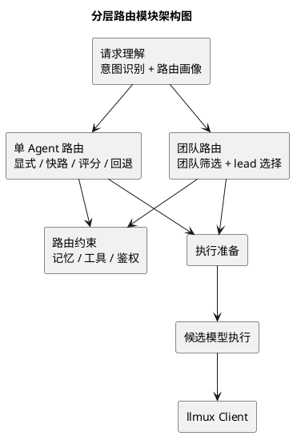
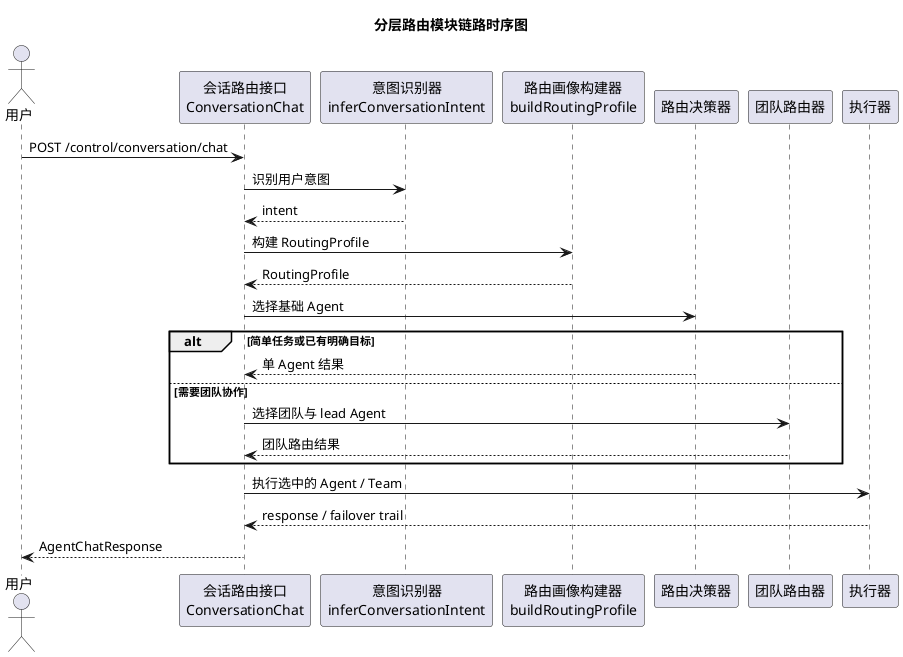
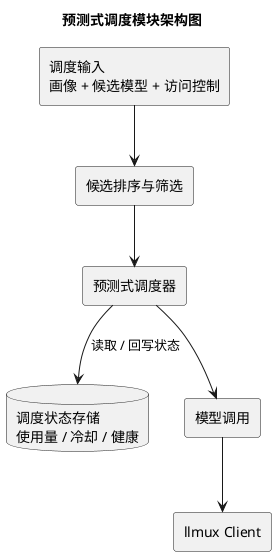
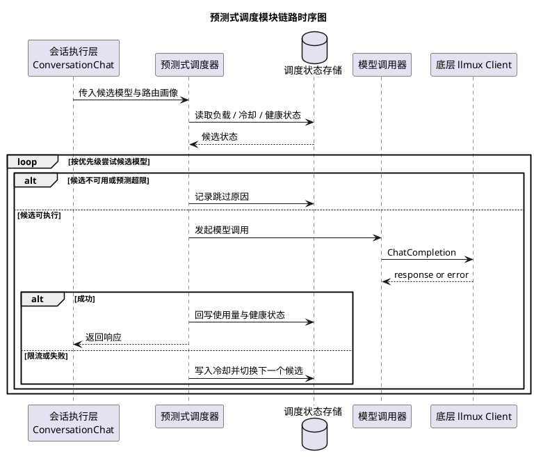
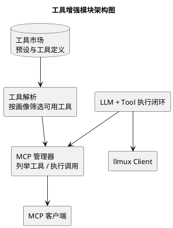
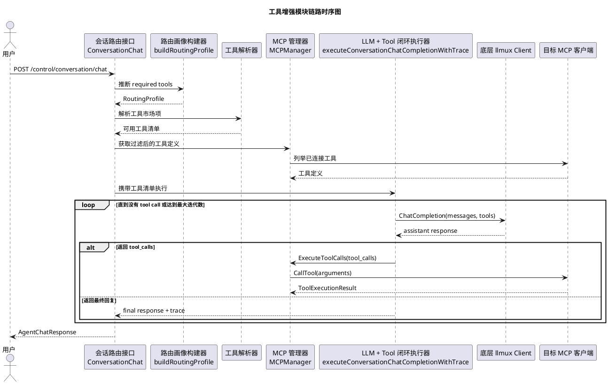
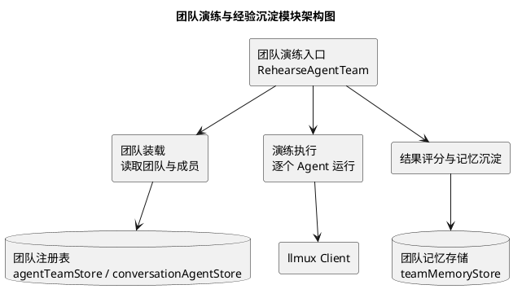
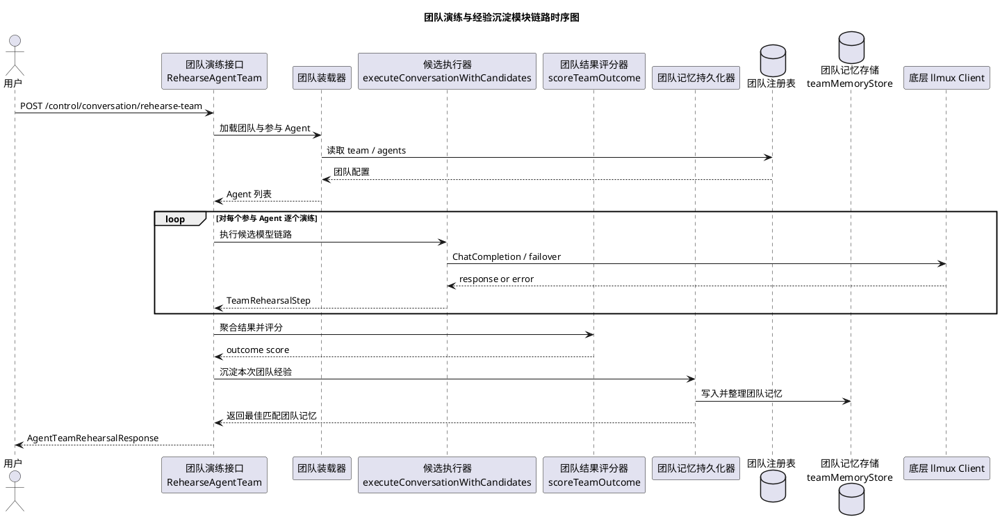

# 模块实现 PlantUML 图集

本文档基于当前代码实现，整理了 5 个核心模块的 PlantUML 图。

为避免论文或 Markdown 预览中图片过于拥挤，以下图均采用“简化展示版”，只保留模块职责与主链路，不再展开函数级细节。

每个模块包含两类图：
- 架构图
- 链路时序图

## 1. 记忆管理模块

相关源码：
- `internal/api/conversation_endpoints.go`
- `internal/api/route_memory.go`
- `internal/api/team_memory.go`
- `internal/api/routing_profile.go`
- `internal/api/agent_team_endpoints.go`

### 1.1 架构图

### 1.2 链路时序图

## 2. 分层路由模块

相关源码：
- `internal/api/conversation_endpoints.go`
- `internal/api/routing_profile.go`
- `internal/api/agent_team_endpoints.go`
- `internal/api/token_optimization.go`

### 2.1 架构图

### 2.2 链路时序图

## 3. 预测式调度模块

相关源码：
- `internal/api/conversation_endpoints.go`
- `internal/api/routing_profile.go`
- `internal/api/value_lab_endpoints.go`

### 3.1 架构图

### 3.2 链路时序图

## 4. 工具增强模块

相关源码：
- `internal/api/conversation_endpoints.go`
- `internal/api/tool_presets.go`
- `internal/api/conversation_execution.go`
- `internal/api/token_optimization.go`
- `internal/mcp/config.go`
- `internal/mcp/interface.go`
- `internal/mcp/manager.go`
- `internal/mcp/tools.go`
- `internal/mcp/transport.go`
- `cmd/mcp-fetch/main.go`

### 4.1 架构图

### 4.2 链路时序图

## 5. 团队演练与经验沉淀模块

相关源码：
- `internal/api/agent_team_endpoints.go`
- `internal/api/team_memory.go`
- `internal/api/conversation_endpoints.go`
- `internal/api/routing_profile.go`

### 5.1 架构图

### 5.2 链路时序图

