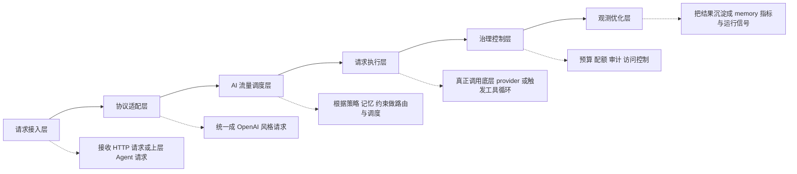
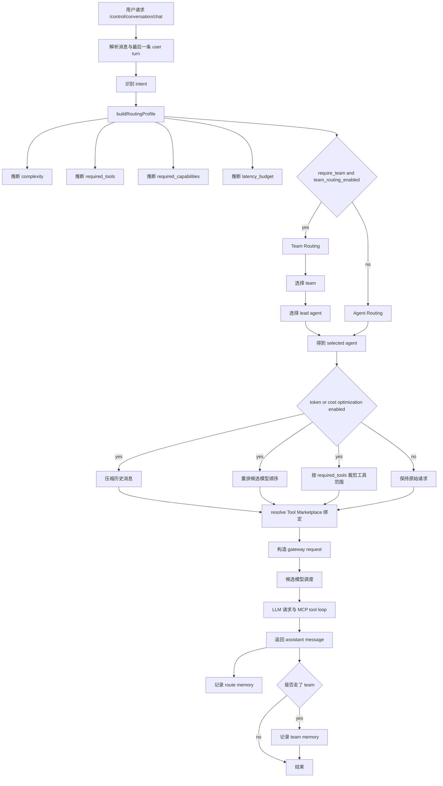
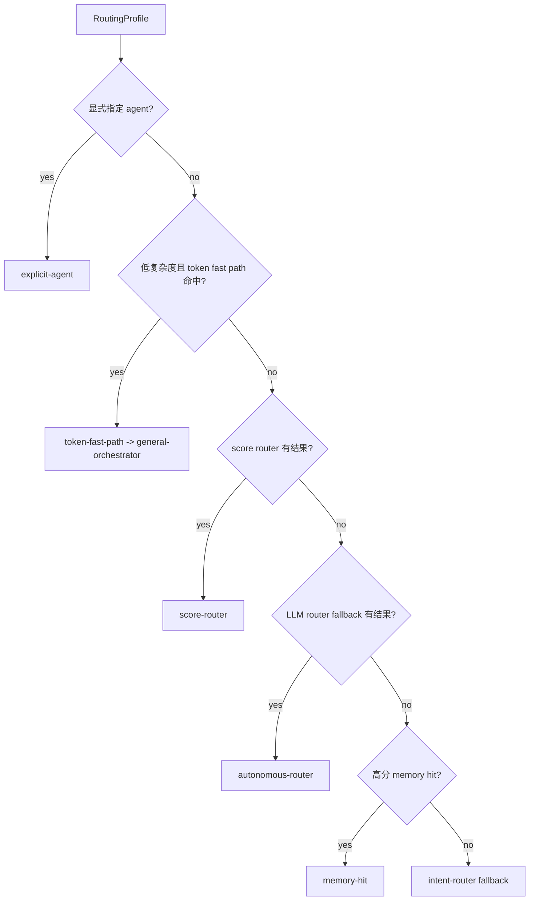
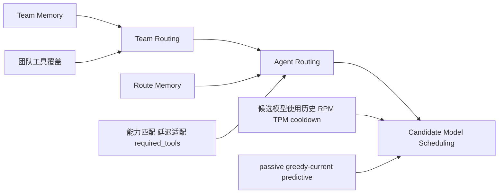
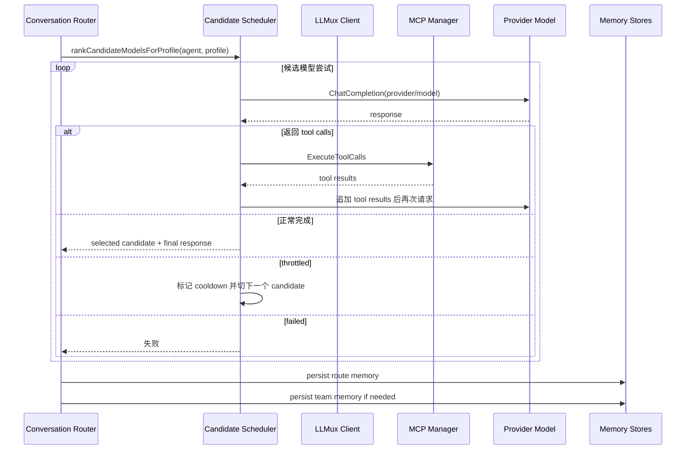
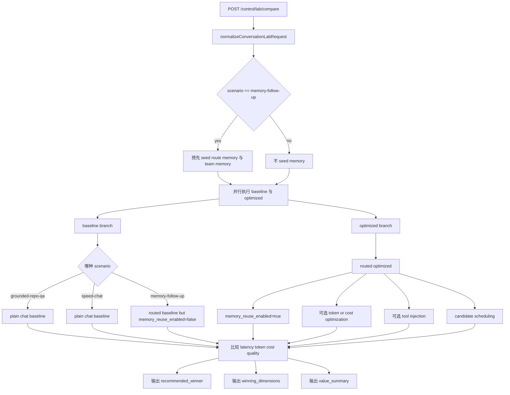
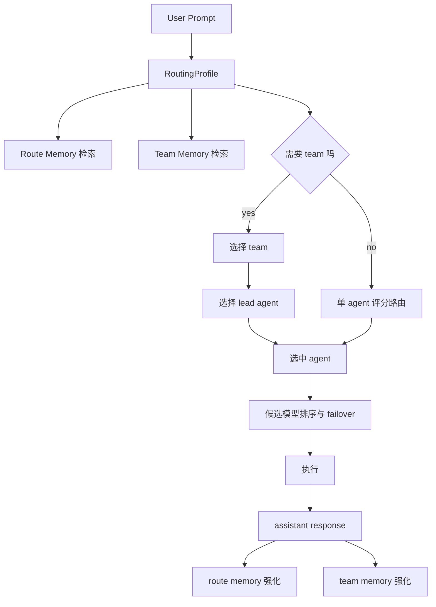
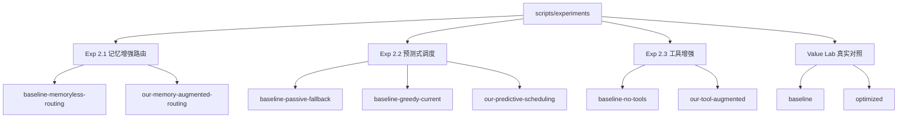

# LLMux 核心链路图解与实验模式地图

## 1. 文档边界

这份图解按当前代码实现绘制，目标不是复述论文愿景，而是把下面三类入口真正会走到的链路画清楚：

- `POST /control/conversation/chat`
- `POST /control/lab/compare`
- `scripts/experiments/run_exp_21_22.py` 与 `scripts/experiments/run_exp_23.py`

可以把这份文档理解成一张实现对齐版地图：

- 平台层概念图
- 实际请求执行图
- Value Lab 对照模式图
- Agent Router 与实验组模式图

## 2. 平台六层概念图

这一层对应 gateway visualizer / simulation 里的概念视角，强调“平台是多层控制面”，不等价于实际函数调用顺序。



如果只问“真正哪一层在打模型”，答案是 `请求执行层`。如果问“哪一层决定为什么打这个模型”，答案主要在 `流量调度层`。

## 3. `control/conversation/chat` 实际核心链路

### 3.1 总体执行图



### 3.2 路由决策优先级

`Agent Router` 不是单一路由器，而是一条有优先级的决策链。



### 3.3 Team Routing, Agent Routing, Candidate Scheduling 的关系



这三层不是并列的三套系统，而是逐层收缩执行路径：

- Team Routing 决定是否先进入一个 team，以及 lead agent 是谁。
- Agent Routing 决定单个 expert agent。
- Candidate Scheduling 决定该 agent 下面到底打哪个 provider/model。

### 3.4 关键评分信号

#### Team 评分

Team 选择大致依赖这四类信号：

- `teamBaseScore`
- capability match
- team memory weight
- tool coverage

可近似写成：

```text
team_score =
  0.30 * base +
  0.35 * capability_match +
  0.20 * team_memory +
  0.15 * tool_coverage
```

#### Agent 评分

单 agent 选择大致依赖：

- `agentBaseScore`
- capability match
- route memory weight
- latency fit
- 如果有 required tools，还会把 tool coverage 纳入评分

典型形式：

```text
agent_score =
  0.25 * base +
  0.35 * capability_match +
  0.20 * route_memory +
  0.20 * latency_fit
```

当请求声明了 `required_tools` 时，会退化成一版更看重 `tool_coverage` 的评分。

#### Candidate 调度策略

候选模型层有三种模式：

- `passive`
  - 基本保持声明顺序/权重顺序
  - 不主动根据预测饱和度预跳过候选
- `greedy-current`
  - 根据当前快照负载决策
  - 看当前时刻的 RPM/TPM 压力
- `predictive`
  - 根据短窗口预测来预判是否会饱和
  - 会提前跳过 `predicted_saturated` 的候选

## 4. 执行层与 MCP tool loop

真正容易出故障的地方不是前面的路由判定，而是后面的执行循环。



可以把失败面分成两类：

- 候选模型层失败
  - unauthorized
  - predicted saturated
  - cooling down
  - provider error
- 工具循环层失败
  - `exceeded maximum tool iterations (N)`

当前真实实验里更突出的瓶颈是第二类，也就是工具循环过长。

## 5. `control/lab/compare` Value Lab 对照模式

### 5.1 Value Lab 总图



### 5.2 Value Lab 三种场景模式

| 场景 | baseline 路径 | optimized 路径 | 主要想观察什么 |
| --- | --- | --- | --- |
| `grounded-repo-qa` | 直接 plain chat，不走复杂路由 | 走完整 routed chain，尽量少量但真实地使用文件工具 | groundedness、tool awareness、route depth |
| `speed-chat` | 直接 plain chat | 仍走优化链，但要求保持轻量 | 快速请求下优化链是否会过度设计 |
| `memory-follow-up` | 走 routed chain，但显式关闭 `memory_reuse_enabled` | 走 routed chain，并允许 memory reuse | 单独隔离记忆重用的价值 |

### 5.3 Value Lab 的关键实验开关

| 开关 | 含义 |
| --- | --- |
| `token_optimization` | 压缩上下文，限制输出预算，裁剪工具范围 |
| `cost_optimization` | 候选模型按更低成本路径重排 |
| `memory_reuse_enabled` | 是否允许 route memory / team memory 直接参与选路 |
| `team_routing_enabled` | 是否允许 team route |
| `candidate_strategy` | `passive` / `greedy-current` / `predictive` |
| `tool_injection_enabled` | 是否把 marketplace 工具真正注入到请求里 |
| `tool_scope_pruning_enabled` | 是否只保留 required tools 对应的工具摘要 |
| `max_tool_iterations` | MCP tool loop 上限 |

### 5.4 Value Lab 的 baseline 不是一直同一种 baseline

这一点很关键：

- 在 `grounded-repo-qa` 与 `speed-chat` 场景里，baseline 是 plain chat baseline。
- 在 `memory-follow-up` 场景里，baseline 不是 plain chat，而是“同一条 routed chain，但禁用 memory reuse”。

也就是说，Value Lab 里至少有两种 baseline 语义：

- `plain baseline`
- `routed baseline without memory reuse`

## 6. Agent Router 视角图

如果把 `control/conversation/chat` 看成一个 memory-enhanced multi-agent router，它的结构可以简化成下面这张图。



从真实实现看，`Agent Router` 的核心不是“让 LLM 随机想一个 agent”，而是把以下信号压进一套带回退顺序的决策链：

- intent
- complexity
- required tools
- required capabilities
- latency budget
- route memory
- team memory
- candidate health
- tenant/org scope

## 7. 实验模式地图

### 7.1 研究实验总图



### 7.2 实验组与开关的对应关系

| 实验 | 入口 | 对照组 | 主要开关 |
| --- | --- | --- | --- |
| Exp 2.1 | `/control/conversation/chat` | `baseline-memoryless-routing` vs `our-memory-augmented-routing` | 主要隔离 `memory_reuse_enabled=false/true` |
| Exp 2.2 | `/control/conversation/chat` | `baseline-passive-fallback` vs `baseline-greedy-current` vs `our-predictive-scheduling` | 主要隔离 `candidate_strategy=passive/greedy-current/predictive` |
| Exp 2.3 | `/control/conversation/chat` | `baseline-no-tools` vs `our-tool-augmented` | 主要隔离 `tool_injection_enabled`、`tool_scope_pruning_enabled`、`max_tool_iterations` |
| Value Lab | `/control/lab/compare` | `baseline` vs `optimized` | 质量收益与执行代价的真实对照 |

### 7.3 Exp 2.3 的特别之处

Exp 2.3 不是在比“谁更会路由”，而是在比“工具增强是否真的改变 agent 的执行能力边界”：

- baseline-no-tools
  - `memory_reuse_enabled=false`
  - `team_routing_enabled=false`
  - `tool_injection_enabled=false`
  - `tool_scope_pruning_enabled=false`
  - `max_tool_iterations=2`
- our-tool-augmented
  - `memory_reuse_enabled=false`
  - `team_routing_enabled=false`
  - `tool_injection_enabled=true`
  - `tool_scope_pruning_enabled=true`
  - `max_tool_iterations=6`

所以 Exp 2.3 的重点不在 memory，不在 team，而在工具能力是否真正进入执行链。

## 8. 一句话看懂当前系统


这条链路的当前工程现实可以概括成：

- 路由层已经明显成形。
- memory 已经真实参与选路。
- candidate scheduling 已经能做策略实验。
- tool augmentation 已经真实改变执行行为。
- 当前主要瓶颈在 tool loop 的迭代控制，而不是 router 完全选不准。

## 9. 对照实现文件

- `internal/api/conversation_endpoints.go`
- `internal/api/routing_profile.go`
- `internal/api/agent_team_endpoints.go`
- `internal/api/token_optimization.go`
- `internal/api/value_lab_endpoints.go`
- `internal/api/conversation_execution.go`
- `internal/mcp/executor.go`
- `internal/api/simulation_endpoints.go`
- `scripts/experiments/run_exp_21_22.py`
- `scripts/experiments/run_exp_23.py`
